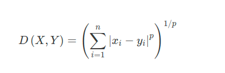
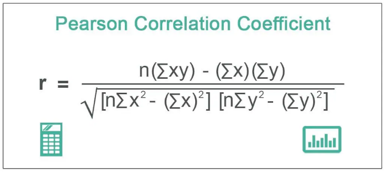

# Minkowski Distance and Pearson correlation coefficient

### Minkowski Distance

Minkowski Distance is the generalized form of Euclidean and Manhattan Distance. The formula for Minkowski distance is given as

For the minkowski distance i used both recursion and higher order function to
implement it based on the following formula of minkowski distance.

### Pearson correlation coefficient

For the pearson correlation coefficient we applied higher order functions on the following formula.  

To evaluate the final result, which is given on the left side, i divided the problem into
smaller manageable tasks as you can see on the right side and handle them individually and
combine the final result. It is a kind of divide and conquer strategy because i found it easy
to handle the problem.

## Reference
1. [Types of Distances in Machine Learning](https://medium.com/analytics-vidhya/types-of-distances-in-machine-learning-5b1233380775)
2. [Pearson Correlation Coefficient](https://www.wallstreetmojo.com/pearson-correlation-coefficient/)
